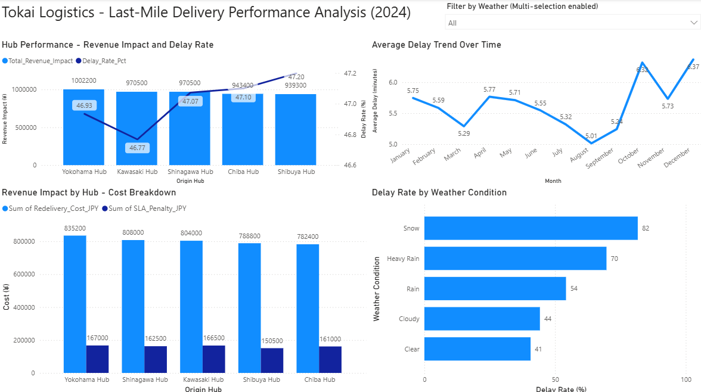

# Tokyo Last-Mile Delivery Performance Analysis - Tokai Logistics

## Executive Summary
Tokai Logistics, a fictional third-party logistics provider serving 
the Greater Tokyo metropolitan area, processed 50,279 deliveries 
across five hubs in 2024 with an overall failure rate of approximately 
10% and an annual revenue impact of ¥5,985,600 under the 
attempt-weighted cost model. Analysis using SQL, Python, AWS S3, 
and Power BI identified three primary drivers of revenue loss: 
customer absence during evening and night delivery windows, 
weather-related delays concentrated in snow and heavy rain conditions, 
and staffing patterns optimized for peak hours but under-resourced 
for transitional periods. Recommended interventions include 
differential delivery window pricing, pre-delivery confirmation for 
night window deliveries projected to recover between ¥358,405 and 
¥502,481 annually, and expansion of alternative delivery options 
through locker pickup and convenience store partnerships.

## Business Problem
Stakeholders at Tokai Logistics requested a 2024 performance analysis 
to identify operational patterns driving delivery failures and 
quantify the revenue impact of those failures. The analysis examined 
four core areas: historical delivery performance across hubs and 
weather conditions, identification of sustained delay trends, areas 
of high failure concentration, and quantification of revenue impact 
from delays and missed deliveries.

## Dashboard


## Methodology
1. Generated a synthetic dataset in Python simulating 50,279 total 
delivery records across 18 columns for the year 2024, calibrated 
against published Japanese logistics industry data including Yamato 
Holdings delivery windows, Japan Meteorological Agency weather 
frequencies, and Ministry of Land, Infrastructure, Transport and 
Tourism delivery failure statistics.

2. Uploaded the cleaned dataset to AWS S3 using Python's boto3 
library, implementing cloud data integration architecture designed 
to scale to Amazon Redshift in a production environment.

3. Built a SQLite database with appropriate indexing on the deliveries 
table and wrote five analytical SQL queries to examine hub delay 
patterns by weather and prefecture, rolling weekly delay trends, 
busiest hours per hub with delay correlation, combined revenue impact 
with attempt-weighted cost modeling, and delivery window performance.

4. Created a Python simulation modeling the financial impact of 
pre-delivery confirmation interventions on Night window deliveries at 
25%, 30%, and 35% failure reduction rates, calibrated against 
published Japanese logistics research.

5. Built an interactive Power BI dashboard connected to the SQLite 
database via ODBC, presenting hub performance with dual-axis 
visualization, monthly delay trends, revenue impact breakdown, and 
weather impact analysis with interactive filtering.

## Skills

**Python:** Synthetic data generation with realistic logistical hub 
delivery time frames and weather condition effects, AWS S3 integration 
via boto3, revenue recovery simulation modeling.

**SQL:** DENSE_RANK, ROW_NUMBER, LAG, PARTITION BY, multi-CTE chained 
queries, CASE WHEN aggregation, attempt-weighted revenue modeling.

**Power BI:** Data modeling, DAX measures, 
interactive slicer, dashboard design, dual-axis charting.

**AWS:** S3 cloud storage configuration, boto3 programmatic upload, 
IAM credential management.

## Results
The five Tokai Logistics hubs operate within a narrow performance band 
of 46.77% to 47.20% delay rate, indicating consistent operational 
capability across the network. However the analysis identified specific 
weather, time of day, and seasonal factors that drive significant 
variation in delivery success within that overall pattern.

The most operationally actionable finding emerged from time-window 
analysis. Failure rates climbed progressively from 8.82% in morning 
windows to 11.87% in night windows, reflecting a 35% relative increase. The 
night window generated ¥964,800 in re-delivery costs alone, 37% higher 
than the morning window. This pattern is consistent with documented 
Japanese consumer absence patterns during evening hours.

A sustained four-week period of progressive performance degradation 
occurred from week 32 through week 35 (August 5 through August 26), 
consistent with Japan's typhoon season impact on Tokyo metropolitan 
deliveries. October showed the year's highest monthly average delay 
at 6.32 minutes followed by another peak in December at 6.37 minutes, 
reflecting holiday peak season volume combined with winter weather 
variability. Delay rates due to snow or heavy rainfall, particularly 
at Chiba and Yokohama Hubs, indicate operational issues or routing 
patterns rather than distance-driven factors.

Performance based on busy periods is mixed. Only Chiba Hub showed the 
expected pattern of higher delay rates correlating with higher volume. 
The remaining four hubs showed inverse or flat patterns, with their 
busiest hours performing better than medium-volume hours. This suggests 
staffing patterns optimized for known peaks but under-resourced during 
transitional periods.

The analysis identified a significant gap in the revenue impact 
methodology. The flat re-delivery cost calculation understates actual 
costs by approximately ¥1,967,200 annually by not accounting for 
multi-attempt failures. The attempt-weighted model captures this 
previously invisible cost component, raising total annual revenue 
impact from ¥4,825,900 to ¥5,985,600.

## Business Recommendation
The revenue recovery model projects that implementing pre-delivery 
confirmation for Night window deliveries alone, calibrated against 
the 25-35% failure reduction documented in published Japanese 
logistics research, would prevent an estimated 301 to 422 failed 
deliveries annually and recover between ¥358,405 and ¥502,481 in 
attempt-weighted re-delivery costs. My recommended actions include:

1. Implement differential pricing for delivery windows, with premium 
rates for evening and night slots, encouraging customers to opt for 
more reliable morning and afternoon delivery windows.

2. Deploy pre-delivery confirmation via SMS or mobile app for evening 
and night window deliveries, requiring customer acknowledgment of 
presence before dispatch.

3. Establish and promote alternative delivery options including locker 
pickup (PUDO locations) and convenience store delivery for customers 
selecting evening or night windows, addressing the customer absence 
problem at the root.

Combining these interventions would extend recovery beyond the night 
window scope and address customer absence patterns across both 
evening and night delivery windows.

## Next Steps
1. Investigate staffing mismatch across all hubs to determine 
efficient staffing solutions for lower-performing time windows.

2. Investigate weather-specific operational protocols including 
vehicle preparation, route adjustments, and predictive scheduling 
during forecasted adverse weather events, particularly for Chiba 
and Yokohama Hubs.

3. Investigate inter-hub coordination opportunities to balance 
volume distribution during weather events or seasonal peaks, allowing 
better-positioned hubs to absorb overflow from heavily impacted hubs.

## Repository Structure

```
Tokyo-Last-Mile-Delivery-Performance-Analysis/
│
├── README.md
├── data/raw/
│   └── tokai_logistics_deliveries.csv
├── python/
│   ├── Tokai_Logistics_Data_Generation.ipynb
│   └── Tokai_Logistics_Recovery_Simulation.ipynb
├── sql/
│   ├── tokai_logistics.db
│   ├── 00_create_schema.sql
│   ├── 01_hub_delay_analysis.sql
│   ├── 02_rolling_weekly_trend.sql
│   ├── 03_busiest_hours_per_hub.sql
│   ├── 04_revenue_impact.sql
│   └── 05_delivery_window_analysis.sql
├── dashboard/
│   ├── Tokai_Logistics_Dashboard.pbix
│   └── dashboard_screenshot.png
├── aws/
│   └── s3_upload_screenshot.png
└── insights/
    └── Tokai_Logistics_Insight_Narrative.docx
```

## How to Run
Requires Python with pandas, numpy, and boto3 installed, a data management tool with SQLite for the database and queries, 
Power BI Desktop for the dashboard, and an AWS account with IAM credentials configured 
via the AWS CLI for the S3 upload script.
